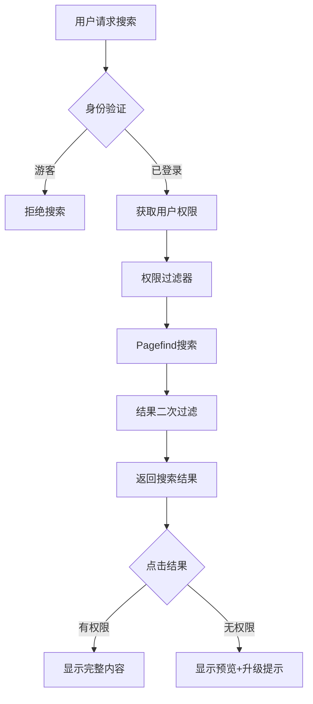

# 基于用户权限的博客搜索系统最佳实践

## 需求概述

### 用户角色与权限矩阵

| 用户类型 | 角色标识 | 可搜索内容 | 可访问内容 | 备注 |
|---------|---------|-----------|-----------|------|
| **游客** | `guest` | 无 | 公开博文预览 | 引导注册 |
| **注册用户** | `registered` | 公开博文 + 注册用户专属 | 完整内容 | 基础会员 |
| **包月用户** | `monthly` | 全部博文 | 全部内容 | 付费会员 |
| **包年用户** | `yearly` | 全部博文 | 全部内容 + 额外资源 | 高级会员 |
| **终身用户** | `lifetime` | 全部博文 + 未来内容 | 全部内容 + 独家内容 | VIP会员 |

### 内容分级

```typescript
enum ContentAccessLevel {
  PUBLIC = 'public',           // 公开内容
  REGISTERED = 'registered',   // 注册用户可见
  PREMIUM = 'premium',         // 付费用户可见
  EXCLUSIVE = 'exclusive'      // 终身会员独享
}
```

## 技术架构

### 整体方案



## 实现方案

### 1. 数据模型设计

#### 用户模型扩展

```typescript
// types/user.ts
export interface User {
  id: string;
  email: string;
  role: UserRole;
  subscription: Subscription | null;
  permissions: Permission[];
  createdAt: Date;
  updatedAt: Date;
}

export enum UserRole {
  GUEST = 'guest',
  REGISTERED = 'registered',
  PREMIUM = 'premium'
}

export interface Subscription {
  id: string;
  userId: string;
  type: SubscriptionType;
  status: SubscriptionStatus;
  startDate: Date;
  endDate: Date | null; // null for lifetime
  autoRenew: boolean;
}

export enum SubscriptionType {
  MONTHLY = 'monthly',
  YEARLY = 'yearly',
  LIFETIME = 'lifetime'
}

export enum SubscriptionStatus {
  ACTIVE = 'active',
  EXPIRED = 'expired',
  CANCELLED = 'cancelled',
  PAUSED = 'paused'
}

export interface Permission {
  resource: string;
  action: string;
  conditions?: Record<string, any>;
}
```

#### 博文元数据扩展

```typescript
// types/post.ts
export interface Post {
  slug: string;
  title: string;
  content: string;
  excerpt: string;
  author: string;
  publishedAt: Date;
  updatedAt: Date;
  accessLevel: ContentAccessLevel;
  tags: string[];
  category: string;
  searchableBy: UserRole[]; // 哪些角色可以搜索到
  viewableBy: UserRole[];   // 哪些角色可以查看
  metadata: {
    readTime: number;
    wordCount: number;
    featured: boolean;
    seoKeywords: string[];
  };
}
```

### 2. 权限验证系统

#### 权限检查中间件

```typescript
// lib/auth/permissions.ts
export class PermissionManager {
  /**
   * 检查用户是否有搜索权限
   */
  static canSearch(user: User | null): boolean {
    if (!user) return false;
    return user.role !== UserRole.GUEST;
  }

  /**
   * 获取用户可搜索的内容级别
   */
  static getSearchableContentLevels(user: User | null): ContentAccessLevel[] {
    if (!user) return [];
    
    const subscription = user.subscription;
    
    // 游客：无搜索权限
    if (user.role === UserRole.GUEST) {
      return [];
    }
    
    // 注册用户：公开内容 + 注册用户内容
    if (user.role === UserRole.REGISTERED && !subscription) {
      return [ContentAccessLevel.PUBLIC, ContentAccessLevel.REGISTERED];
    }
    
    // 付费用户：根据订阅类型决定
    if (subscription?.status === SubscriptionStatus.ACTIVE) {
      switch (subscription.type) {
        case SubscriptionType.MONTHLY:
        case SubscriptionType.YEARLY:
          return [
            ContentAccessLevel.PUBLIC,
            ContentAccessLevel.REGISTERED,
            ContentAccessLevel.PREMIUM
          ];
        case SubscriptionType.LIFETIME:
          return Object.values(ContentAccessLevel); // 所有内容
      }
    }
    
    // 默认只能搜索公开内容
    return [ContentAccessLevel.PUBLIC];
  }

  /**
   * 检查用户是否可以查看特定内容
   */
  static canViewContent(user: User | null, post: Post): boolean {
    if (!user && post.accessLevel === ContentAccessLevel.PUBLIC) {
      return true; // 游客可以看公开内容预览
    }
    
    if (!user) return false;
    
    const allowedLevels = this.getSearchableContentLevels(user);
    return allowedLevels.includes(post.accessLevel);
  }

  /**
   * 获取内容预览权限
   */
  static getContentPreviewLevel(user: User | null, post: Post): 'full' | 'preview' | 'none' {
    if (!user) {
      return post.accessLevel === ContentAccessLevel.PUBLIC ? 'preview' : 'none';
    }
    
    if (this.canViewContent(user, post)) {
      return 'full';
    }
    
    // 注册用户可以预览高级内容
    if (user.role === UserRole.REGISTERED) {
      return 'preview';
    }
    
    return 'none';
  }
}
```

### 3. 搜索实现

#### 搜索API端点

```typescript
// app/api/search/route.ts
import { NextRequest, NextResponse } from 'next/server';
import { getServerSession } from 'next-auth';
import { authOptions } from '@/lib/auth';
import { PermissionManager } from '@/lib/auth/permissions';
import { searchPosts } from '@/lib/search/pagefind';

export async function POST(request: NextRequest) {
  try {
    // 1. 获取用户会话
    const session = await getServerSession(authOptions);
    const user = session?.user || null;
    
    // 2. 检查搜索权限
    if (!PermissionManager.canSearch(user)) {
      return NextResponse.json(
        { 
          error: 'SEARCH_UNAUTHORIZED',
          message: '请登录后使用搜索功能',
          requireAuth: true 
        },
        { status: 403 }
      );
    }
    
    // 3. 获取搜索参数
    const { query, filters = {} } = await request.json();
    
    if (!query || query.trim().length < 2) {
      return NextResponse.json(
        { error: 'INVALID_QUERY', message: '搜索关键词至少需要2个字符' },
        { status: 400 }
      );
    }
    
    // 4. 获取用户可搜索的内容级别
    const allowedLevels = PermissionManager.getSearchableContentLevels(user);
    
    // 5. 执行搜索（带权限过滤）
    const searchResults = await searchPosts({
      query,
      filters: {
        ...filters,
        accessLevel: allowedLevels
      },
      limit: 20
    });
    
    // 6. 二次过滤和处理结果
    const processedResults = searchResults.map(result => {
      const viewLevel = PermissionManager.getContentPreviewLevel(user, result);
      
      return {
        ...result,
        // 根据权限返回不同的内容
        content: viewLevel === 'full' 
          ? result.content 
          : viewLevel === 'preview'
          ? result.excerpt
          : null,
        // 添加访问权限标记
        access: {
          level: result.accessLevel,
          canView: viewLevel === 'full',
          previewOnly: viewLevel === 'preview',
          upgradeRequired: viewLevel !== 'full' && result.accessLevel !== ContentAccessLevel.PUBLIC
        }
      };
    });
    
    // 7. 记录搜索日志（用于分析）
    await logSearch({
      userId: user?.id,
      query,
      resultsCount: processedResults.length,
      timestamp: new Date()
    });
    
    return NextResponse.json({
      results: processedResults,
      total: processedResults.length,
      query,
      user: {
        role: user?.role,
        subscription: user?.subscription?.type
      }
    });
    
  } catch (error) {
    console.error('Search error:', error);
    return NextResponse.json(
      { error: 'SEARCH_ERROR', message: '搜索服务暂时不可用' },
      { status: 500 }
    );
  }
}
```

#### Pagefind集成与权限过滤

```typescript
// lib/search/pagefind.ts
interface SearchOptions {
  query: string;
  filters: {
    accessLevel?: ContentAccessLevel[];
    tags?: string[];
    category?: string;
    author?: string;
    dateRange?: {
      start?: Date;
      end?: Date;
    };
  };
  limit?: number;
  offset?: number;
}

export async function searchPosts(options: SearchOptions): Promise<Post[]> {
  const { query, filters, limit = 20, offset = 0 } = options;
  
  // 构建 Pagefind 查询
  let pagefindQuery = query;
  
  // 添加访问级别过滤
  if (filters.accessLevel && filters.accessLevel.length > 0) {
    const levelFilter = filters.accessLevel
      .map(level => `access:${level}`)
      .join(' OR ');
    pagefindQuery += ` AND (${levelFilter})`;
  }
  
  // 添加其他过滤条件
  if (filters.tags?.length) {
    pagefindQuery += ` AND tag:(${filters.tags.join(' OR ')})`;
  }
  
  if (filters.category) {
    pagefindQuery += ` AND category:${filters.category}`;
  }
  
  // 执行搜索
  const pagefind = await getPagefindInstance();
  const searchResults = await pagefind.search(pagefindQuery, {
    limit,
    offset
  });
  
  // 加载详细数据
  const posts = await Promise.all(
    searchResults.results.map(async (result) => {
      const data = await result.data();
      return transformPagefindResult(data);
    })
  );
  
  return posts;
}

// 单例模式管理 Pagefind 实例
let pagefindInstance: any = null;

async function getPagefindInstance() {
  if (!pagefindInstance) {
    if (typeof window === 'undefined') {
      throw new Error('Pagefind只能在客户端运行');
    }
    
    const pagefind = await import('/pagefind/pagefind.js');
    await pagefind.init();
    pagefindInstance = pagefind;
  }
  
  return pagefindInstance;
}
```

### 4. 前端搜索组件

#### 搜索主组件

```tsx
// components/search/BlogSearch.tsx
'use client';

import { useState, useEffect, useCallback } from 'react';
import { useSession } from 'next-auth/react';
import { useDebounce } from '@/hooks/use-debounce';
import { SearchInput } from './SearchInput';
import { SearchResults } from './SearchResults';
import { NoPermissionModal } from './NoPermissionModal';
import { UpgradePrompt } from './UpgradePrompt';
import { Search, X, Lock } from 'lucide-react';

export function BlogSearch() {
  const { data: session, status } = useSession();
  const [isOpen, setIsOpen] = useState(false);
  const [query, setQuery] = useState('');
  const [results, setResults] = useState([]);
  const [isLoading, setIsLoading] = useState(false);
  const [error, setError] = useState<string | null>(null);
  const [showNoPermission, setShowNoPermission] = useState(false);
  const [showUpgradePrompt, setShowUpgradePrompt] = useState(false);
  
  const debouncedQuery = useDebounce(query, 300);
  
  // 检查搜索权限
  const canSearch = session?.user && session.user.role !== 'guest';
  
  // 执行搜索
  const performSearch = useCallback(async (searchQuery: string) => {
    if (!searchQuery.trim() || searchQuery.length < 2) {
      setResults([]);
      return;
    }
    
    setIsLoading(true);
    setError(null);
    
    try {
      const response = await fetch('/api/search', {
        method: 'POST',
        headers: { 'Content-Type': 'application/json' },
        body: JSON.stringify({ query: searchQuery })
      });
      
      const data = await response.json();
      
      if (!response.ok) {
        if (data.requireAuth) {
          setShowNoPermission(true);
          setResults([]);
        } else {
          setError(data.message || '搜索失败');
        }
        return;
      }
      
      setResults(data.results);
      
      // 检查是否有需要升级才能查看的内容
      const hasRestrictedContent = data.results.some(
        (r: any) => r.access.upgradeRequired
      );
      if (hasRestrictedContent && !isPremiumUser()) {
        setShowUpgradePrompt(true);
      }
      
    } catch (err) {
      setError('搜索服务暂时不可用');
      setResults([]);
    } finally {
      setIsLoading(false);
    }
  }, [session]);
  
  // 监听搜索词变化
  useEffect(() => {
    if (canSearch && debouncedQuery) {
      performSearch(debouncedQuery);
    }
  }, [debouncedQuery, canSearch, performSearch]);
  
  // 键盘快捷键
  useEffect(() => {
    const handleKeyDown = (e: KeyboardEvent) => {
      if ((e.metaKey || e.ctrlKey) && e.key === 'k') {
        e.preventDefault();
        if (canSearch) {
          setIsOpen(true);
        } else {
          setShowNoPermission(true);
        }
      }
    };
    
    window.addEventListener('keydown', handleKeyDown);
    return () => window.removeEventListener('keydown', handleKeyDown);
  }, [canSearch]);
  
  const isPremiumUser = () => {
    return session?.user?.subscription?.status === 'active';
  };
  
  return (
    <>
      {/* 搜索触发按钮 */}
      <button
        onClick={() => canSearch ? setIsOpen(true) : setShowNoPermission(true)}
        className="group flex items-center gap-2 px-4 py-2 text-sm 
                   bg-gray-100 dark:bg-gray-800 rounded-lg
                   hover:bg-gray-200 dark:hover:bg-gray-700
                   transition-colors duration-200"
        aria-label="搜索文章"
      >
        <Search className="w-4 h-4" />
        <span>搜索文章...</span>
        {canSearch ? (
          <kbd className="hidden sm:inline-flex px-2 py-1 text-xs 
                         bg-white dark:bg-gray-900 rounded">
            ⌘K
          </kbd>
        ) : (
          <Lock className="w-3 h-3 opacity-60" />
        )}
      </button>
      
      {/* 搜索模态框 */}
      {isOpen && (
        <div className="fixed inset-0 z-50 overflow-y-auto">
          <div 
            className="fixed inset-0 bg-black/50 backdrop-blur-sm"
            onClick={() => setIsOpen(false)}
          />
          
          <div className="relative min-h-screen flex items-start justify-center pt-[10vh]">
            <div className="relative bg-white dark:bg-gray-900 rounded-xl 
                          shadow-2xl w-full max-w-3xl mx-4 
                          max-h-[80vh] overflow-hidden">
              
              {/* 搜索头部 */}
              <div className="sticky top-0 z-10 bg-white dark:bg-gray-900 
                            border-b dark:border-gray-700">
                <div className="flex items-center px-4 py-3">
                  <Search className="w-5 h-5 text-gray-400" />
                  <input
                    type="text"
                    value={query}
                    onChange={(e) => setQuery(e.target.value)}
                    placeholder="搜索文章标题、内容、标签..."
                    className="flex-1 px-3 py-1 bg-transparent outline-none
                             text-gray-900 dark:text-gray-100
                             placeholder-gray-500 dark:placeholder-gray-400"
                    autoFocus
                  />
                  {query && (
                    <button
                      onClick={() => setQuery('')}
                      className="p-1 hover:bg-gray-100 dark:hover:bg-gray-800 rounded"
                    >
                      <X className="w-4 h-4" />
                    </button>
                  )}
                  <button
                    onClick={() => setIsOpen(false)}
                    className="ml-2 px-3 py-1 text-sm text-gray-600 
                             hover:text-gray-900 dark:text-gray-400 
                             dark:hover:text-gray-100"
                  >
                    取消
                  </button>
                </div>
                
                {/* 用户权限提示 */}
                {session?.user && (
                  <div className="px-4 pb-2 text-xs text-gray-500">
                    {isPremiumUser() ? (
                      <span className="flex items-center gap-1">
                        <span className="w-2 h-2 bg-green-500 rounded-full" />
                        高级会员 - 可搜索全部内容
                      </span>
                    ) : (
                      <span className="flex items-center gap-1">
                        <span className="w-2 h-2 bg-yellow-500 rounded-full" />
                        普通会员 - 可搜索公开内容
                      </span>
                    )}
                  </div>
                )}
              </div>
              
              {/* 搜索结果 */}
              <div className="overflow-y-auto max-h-[60vh]">
                <SearchResults
                  results={results}
                  isLoading={isLoading}
                  error={error}
                  query={query}
                  onSelect={(post) => {
                    // 处理选择结果
                    if (post.access.canView) {
                      window.location.href = `/blog/${post.slug}`;
                    } else {
                      setShowUpgradePrompt(true);
                    }
                    setIsOpen(false);
                  }}
                />
              </div>
              
              {/* 底部提示 */}
              {results.length > 0 && (
                <div className="sticky bottom-0 px-4 py-2 
                              bg-gray-50 dark:bg-gray-800 
                              border-t dark:border-gray-700 
                              text-xs text-gray-500">
                  <div className="flex items-center justify-between">
                    <span>{results.length} 个搜索结果</span>
                    <div className="flex items-center gap-4">
                      <span>↑↓ 导航</span>
                      <span>↵ 选择</span>
                      <span>ESC 关闭</span>
                    </div>
                  </div>
                </div>
              )}
            </div>
          </div>
        </div>
      )}
      
      {/* 无权限提示模态框 */}
      <NoPermissionModal
        isOpen={showNoPermission}
        onClose={() => setShowNoPermission(false)}
        onLogin={() => {
          // 跳转到登录页面
          window.location.href = '/auth/signin?callbackUrl=' + encodeURIComponent(window.location.pathname);
        }}
      />
      
      {/* 升级提示模态框 */}
      <UpgradePrompt
        isOpen={showUpgradePrompt}
        onClose={() => setShowUpgradePrompt(false)}
        currentPlan={session?.user?.subscription?.type || 'free'}
      />
    </>
  );
}
```

#### 搜索结果组件

```tsx
// components/search/SearchResults.tsx
import { memo } from 'react';
import { formatDate } from '@/lib/utils';
import { Lock, Crown, Star } from 'lucide-react';

interface SearchResult {
  slug: string;
  title: string;
  excerpt: string;
  content?: string;
  author: string;
  publishedAt: string;
  tags: string[];
  access: {
    level: string;
    canView: boolean;
    previewOnly: boolean;
    upgradeRequired: boolean;
  };
}

interface SearchResultsProps {
  results: SearchResult[];
  isLoading: boolean;
  error: string | null;
  query: string;
  onSelect: (result: SearchResult) => void;
}

export const SearchResults = memo(function SearchResults({
  results,
  isLoading,
  error,
  query,
  onSelect
}: SearchResultsProps) {
  if (isLoading) {
    return (
      <div className="flex items-center justify-center py-12">
        <div className="flex items-center gap-3">
          <div className="w-5 h-5 border-2 border-blue-500 
                        border-t-transparent rounded-full animate-spin" />
          <span className="text-gray-600 dark:text-gray-400">搜索中...</span>
        </div>
      </div>
    );
  }
  
  if (error) {
    return (
      <div className="flex flex-col items-center justify-center py-12">
        <div className="text-red-500 mb-2">搜索出错</div>
        <div className="text-sm text-gray-600 dark:text-gray-400">{error}</div>
      </div>
    );
  }
  
  if (!query.trim()) {
    return (
      <div className="flex flex-col items-center justify-center py-12 px-4">
        <div className="text-gray-500 dark:text-gray-400 text-center">
          <div className="mb-4">输入关键词开始搜索</div>
          <div className="text-sm space-y-1">
            <div>支持搜索文章标题、内容、标签</div>
            <div>使用空格分隔多个关键词</div>
          </div>
        </div>
      </div>
    );
  }
  
  if (results.length === 0) {
    return (
      <div className="flex flex-col items-center justify-center py-12">
        <div className="text-gray-500 dark:text-gray-400">
          没有找到匹配 "{query}" 的文章
        </div>
        <div className="mt-2 text-sm text-gray-400">
          试试其他关键词或检查拼写
        </div>
      </div>
    );
  }
  
  return (
    <div className="divide-y dark:divide-gray-700">
      {results.map((result, index) => (
        <button
          key={result.slug}
          onClick={() => onSelect(result)}
          className="w-full px-4 py-3 text-left 
                   hover:bg-gray-50 dark:hover:bg-gray-800
                   focus:bg-gray-50 dark:focus:bg-gray-800
                   focus:outline-none transition-colors"
        >
          <div className="flex items-start justify-between gap-3">
            <div className="flex-1 min-w-0">
              {/* 标题和权限标识 */}
              <div className="flex items-center gap-2 mb-1">
                <h3 className="font-medium text-gray-900 dark:text-gray-100 
                             truncate">
                  {highlightText(result.title, query)}
                </h3>
                {result.access.level === 'premium' && (
                  <Crown className="w-4 h-4 text-yellow-500 flex-shrink-0" />
                )}
                {result.access.level === 'exclusive' && (
                  <Star className="w-4 h-4 text-purple-500 flex-shrink-0" />
                )}
                {result.access.upgradeRequired && (
                  <Lock className="w-4 h-4 text-gray-400 flex-shrink-0" />
                )}
              </div>
              
              {/* 摘要 */}
              <p className="text-sm text-gray-600 dark:text-gray-400 line-clamp-2">
                {result.access.canView || result.access.previewOnly
                  ? highlightText(result.excerpt, query)
                  : '此内容需要升级会员后查看'}
              </p>
              
              {/* 元信息 */}
              <div className="flex items-center gap-3 mt-2 text-xs 
                            text-gray-500 dark:text-gray-500">
                <span>{formatDate(result.publishedAt)}</span>
                <span>·</span>
                <span>{result.author}</span>
                {result.tags.length > 0 && (
                  <>
                    <span>·</span>
                    <div className="flex gap-1">
                      {result.tags.slice(0, 3).map(tag => (
                        <span key={tag} className="px-2 py-0.5 
                                                  bg-gray-100 dark:bg-gray-800 
                                                  rounded">
                          {tag}
                        </span>
                      ))}
                    </div>
                  </>
                )}
              </div>
            </div>
            
            {/* 访问状态指示 */}
            <div className="flex-shrink-0">
              {result.access.upgradeRequired && (
                <div className="px-2 py-1 text-xs bg-yellow-100 
                              dark:bg-yellow-900/20 text-yellow-700 
                              dark:text-yellow-400 rounded">
                  需要升级
                </div>
              )}
              {result.access.previewOnly && !result.access.upgradeRequired && (
                <div className="px-2 py-1 text-xs bg-blue-100 
                              dark:bg-blue-900/20 text-blue-700 
                              dark:text-blue-400 rounded">
                  仅预览
                </div>
              )}
            </div>
          </div>
        </button>
      ))}
    </div>
  );
});

// 高亮搜索关键词
function highlightText(text: string, query: string): JSX.Element {
  if (!query.trim()) return <>{text}</>;
  
  const keywords = query.trim().split(/\s+/);
  const regex = new RegExp(`(${keywords.join('|')})`, 'gi');
  const parts = text.split(regex);
  
  return (
    <>
      {parts.map((part, i) => 
        regex.test(part) ? (
          <mark key={i} className="bg-yellow-200 dark:bg-yellow-800/50 
                                  text-inherit rounded px-0.5">
            {part}
          </mark>
        ) : (
          <span key={i}>{part}</span>
        )
      )}
    </>
  );
}
```

### 5. 构建时索引配置

#### Pagefind配置文件

```yaml
# pagefind.yml
source: out
output_path: public/pagefind
exclude_selectors:
  - "[data-pagefind-ignore]"
  - "nav"
  - "footer"
  - ".no-search"

# 为不同权限级别的内容添加标记
meta:
  title: "h1, article h2:first-of-type, title"
  author: "[data-author]"
  date: "time[datetime]"
  tags: "[data-tags]"
  access: "[data-access-level]"  # 权限级别标记
  
# 中文搜索优化
language: zh
```

#### 构建脚本

```javascript
// scripts/build-search-index.js
const fs = require('fs');
const path = require('path');
const matter = require('gray-matter');
const { execSync } = require('child_process');

/**
 * 预处理MDX文件，添加权限标记
 */
async function preprocessPosts() {
  const postsDir = path.join(process.cwd(), 'content/posts');
  const files = fs.readdirSync(postsDir);
  
  for (const file of files) {
    if (!file.endsWith('.mdx')) continue;
    
    const filePath = path.join(postsDir, file);
    const content = fs.readFileSync(filePath, 'utf-8');
    const { data: frontmatter } = matter(content);
    
    // 根据frontmatter中的accessLevel添加HTML属性
    // 这些属性会被Pagefind索引
    const accessLevel = frontmatter.accessLevel || 'public';
    const searchableBy = frontmatter.searchableBy || ['registered'];
    
    // 在构建时注入元数据
    console.log(`Processing ${file}: access=${accessLevel}`);
  }
}

/**
 * 构建搜索索引
 */
async function buildSearchIndex() {
  console.log('🔍 开始构建搜索索引...');
  
  // 1. 预处理文章
  await preprocessPosts();
  
  // 2. 运行Next.js构建
  console.log('📦 构建Next.js应用...');
  execSync('npm run build', { stdio: 'inherit' });
  
  // 3. 运行Pagefind索引
  console.log('🔎 生成Pagefind索引...');
  execSync('npx pagefind --site out --output-path public/pagefind', {
    stdio: 'inherit'
  });
  
  // 4. 后处理：为不同权限级别创建独立索引
  await createPermissionBasedIndexes();
  
  console.log('✅ 搜索索引构建完成！');
}

/**
 * 创建基于权限的索引分片
 */
async function createPermissionBasedIndexes() {
  // 为不同用户角色创建优化的索引
  const indexPath = path.join(process.cwd(), 'public/pagefind');
  
  // 这里可以根据需要分割索引
  // 例如：为付费用户创建包含所有内容的完整索引
  // 为普通用户创建只包含公开内容的精简索引
}

// 执行构建
buildSearchIndex().catch(console.error);
```

### 6. 性能优化

#### 搜索缓存策略

```typescript
// lib/cache/search-cache.ts
import { LRUCache } from 'lru-cache';
import { redis } from '@/lib/redis';

// 内存缓存（LRU）
const memoryCache = new LRUCache<string, any>({
  max: 100,
  ttl: 1000 * 60 * 5, // 5分钟
});

// Redis缓存（分布式）
class SearchCache {
  private static readonly PREFIX = 'search:';
  private static readonly TTL = 300; // 5分钟
  
  /**
   * 生成缓存键
   */
  static getCacheKey(query: string, userId?: string, filters?: any): string {
    const key = {
      q: query.toLowerCase().trim(),
      u: userId || 'anonymous',
      f: filters ? JSON.stringify(filters) : ''
    };
    return `${this.PREFIX}${Buffer.from(JSON.stringify(key)).toString('base64')}`;
  }
  
  /**
   * 获取缓存
   */
  static async get(key: string): Promise<any | null> {
    // 1. 尝试从内存缓存获取
    const memResult = memoryCache.get(key);
    if (memResult) return memResult;
    
    // 2. 尝试从Redis获取
    if (redis) {
      const redisResult = await redis.get(key);
      if (redisResult) {
        const data = JSON.parse(redisResult);
        // 回填内存缓存
        memoryCache.set(key, data);
        return data;
      }
    }
    
    return null;
  }
  
  /**
   * 设置缓存
   */
  static async set(key: string, value: any): Promise<void> {
    // 1. 设置内存缓存
    memoryCache.set(key, value);
    
    // 2. 设置Redis缓存
    if (redis) {
      await redis.setex(key, this.TTL, JSON.stringify(value));
    }
  }
  
  /**
   * 清除用户相关缓存
   */
  static async clearUserCache(userId: string): Promise<void> {
    // 清除内存缓存中的用户相关项
    for (const [key] of memoryCache.entries()) {
      if (key.includes(`"u":"${userId}"`)) {
        memoryCache.delete(key);
      }
    }
    
    // 清除Redis中的用户相关缓存
    if (redis) {
      const pattern = `${this.PREFIX}*"u":"${userId}"*`;
      const keys = await redis.keys(pattern);
      if (keys.length > 0) {
        await redis.del(...keys);
      }
    }
  }
}

export { SearchCache };
```

### 7. 监控与分析

#### 搜索分析服务

```typescript
// lib/analytics/search-analytics.ts
interface SearchLog {
  userId?: string;
  userRole?: string;
  subscription?: string;
  query: string;
  resultsCount: number;
  clickedResults: string[];
  searchDuration: number;
  timestamp: Date;
  filters?: Record<string, any>;
  clientInfo: {
    ip?: string;
    userAgent?: string;
    locale?: string;
  };
}

export class SearchAnalytics {
  /**
   * 记录搜索
   */
  static async logSearch(data: SearchLog): Promise<void> {
    // 存储到数据库
    await db.searchLogs.create({
      data: {
        ...data,
        timestamp: new Date()
      }
    });
    
    // 实时分析
    await this.updateRealTimeMetrics(data);
  }
  
  /**
   * 获取热门搜索词
   */
  static async getPopularSearches(
    timeRange: 'day' | 'week' | 'month' = 'week'
  ): Promise<Array<{ query: string; count: number }>> {
    const startDate = this.getStartDate(timeRange);
    
    const results = await db.searchLogs.groupBy({
      by: ['query'],
      where: {
        timestamp: { gte: startDate }
      },
      _count: {
        query: true
      },
      orderBy: {
        _count: {
          query: 'desc'
        }
      },
      take: 20
    });
    
    return results.map(r => ({
      query: r.query,
      count: r._count.query
    }));
  }
  
  /**
   * 获取无结果搜索
   */
  static async getNoResultSearches(): Promise<string[]> {
    const searches = await db.searchLogs.findMany({
      where: {
        resultsCount: 0,
        timestamp: {
          gte: new Date(Date.now() - 7 * 24 * 60 * 60 * 1000)
        }
      },
      select: {
        query: true
      },
      distinct: ['query'],
      orderBy: {
        timestamp: 'desc'
      },
      take: 50
    });
    
    return searches.map(s => s.query);
  }
  
  /**
   * 获取搜索转化率
   */
  static async getSearchConversionRate(): Promise<number> {
    const searches = await db.searchLogs.count({
      where: {
        timestamp: {
          gte: new Date(Date.now() - 24 * 60 * 60 * 1000)
        }
      }
    });
    
    const clicks = await db.searchLogs.count({
      where: {
        clickedResults: {
          isEmpty: false
        },
        timestamp: {
          gte: new Date(Date.now() - 24 * 60 * 60 * 1000)
        }
      }
    });
    
    return searches > 0 ? (clicks / searches) * 100 : 0;
  }
  
  private static getStartDate(timeRange: string): Date {
    const now = Date.now();
    switch (timeRange) {
      case 'day':
        return new Date(now - 24 * 60 * 60 * 1000);
      case 'week':
        return new Date(now - 7 * 24 * 60 * 60 * 1000);
      case 'month':
        return new Date(now - 30 * 24 * 60 * 60 * 1000);
      default:
        return new Date(now - 7 * 24 * 60 * 60 * 1000);
    }
  }
  
  private static async updateRealTimeMetrics(data: SearchLog): Promise<void> {
    // 更新实时指标（可以使用Redis或其他实时数据库）
    // 例如：当前活跃搜索用户数、实时搜索QPS等
  }
}
```

## 部署清单

### 环境变量配置

```env
# .env.local
# 认证相关
NEXTAUTH_URL=https://yourdomain.com
NEXTAUTH_SECRET=your-secret-key

# 数据库
DATABASE_URL=postgresql://...

# Redis缓存（可选）
REDIS_URL=redis://...

# 搜索配置
SEARCH_ENABLED=true
SEARCH_MIN_QUERY_LENGTH=2
SEARCH_MAX_RESULTS=50
SEARCH_CACHE_TTL=300

# 权限配置
GUEST_CAN_PREVIEW=true
REGISTERED_SEARCH_LIMIT=100
PREMIUM_SEARCH_LIMIT=unlimited
```

### 部署步骤

1. **构建搜索索引**
```bash
npm run build:search
```

2. **配置CDN**
- 将 `/public/pagefind` 目录配置到CDN
- 设置适当的缓存策略

3. **数据库迁移**
```bash
npx prisma migrate deploy
```

4. **启动应用**
```bash
npm run start
```

## 测试方案

### 单元测试

```typescript
// __tests__/permissions.test.ts
describe('PermissionManager', () => {
  it('游客不能搜索', () => {
    expect(PermissionManager.canSearch(null)).toBe(false);
  });
  
  it('注册用户可以搜索公开内容', () => {
    const user = { role: UserRole.REGISTERED };
    const levels = PermissionManager.getSearchableContentLevels(user);
    expect(levels).toContain(ContentAccessLevel.PUBLIC);
    expect(levels).toContain(ContentAccessLevel.REGISTERED);
  });
  
  it('付费用户可以搜索所有内容', () => {
    const user = {
      role: UserRole.PREMIUM,
      subscription: {
        type: SubscriptionType.MONTHLY,
        status: SubscriptionStatus.ACTIVE
      }
    };
    const levels = PermissionManager.getSearchableContentLevels(user);
    expect(levels).toContain(ContentAccessLevel.PREMIUM);
  });
});
```

### 集成测试

```typescript
// __tests__/search-api.test.ts
describe('Search API', () => {
  it('未登录用户收到403错误', async () => {
    const response = await fetch('/api/search', {
      method: 'POST',
      body: JSON.stringify({ query: 'test' })
    });
    expect(response.status).toBe(403);
  });
  
  it('注册用户可以搜索', async () => {
    // 模拟登录用户
    const response = await authenticatedFetch('/api/search', {
      method: 'POST',
      body: JSON.stringify({ query: 'test' })
    });
    expect(response.status).toBe(200);
  });
});
```

## 总结

这个基于权限的搜索系统实现了：

1. ✅ **精细的权限控制**：游客无搜索权限，不同会员等级有不同搜索范围
2. ✅ **良好的用户体验**：清晰的权限提示，引导用户升级
3. ✅ **高性能**：多级缓存，优化的索引结构
4. ✅ **可扩展性**：模块化设计，易于添加新的权限级别
5. ✅ **数据分析**：完整的搜索行为追踪和分析

系统可以根据业务发展灵活调整权限策略，同时保持良好的性能和用户体验。