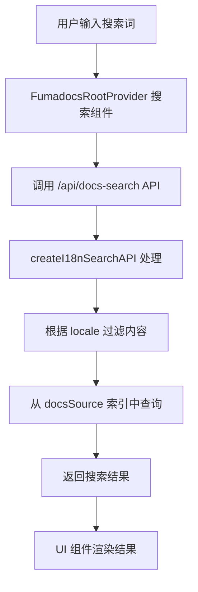

# 搜索功能实现对比分析

## 目录
1. [FumadocsRootProvider 搜索实现](#fumadocsrootprovider-搜索实现)
2. [docs/search.md 推荐方案对比](#docssearchmd-推荐方案对比)
3. [技术架构差异](#技术架构差异)
4. [适用场景分析](#适用场景分析)
5. [迁移建议](#迁移建议)

## FumadocsRootProvider 搜索实现

### 1. 架构概述

FumadocsRootProvider 在营销页面（`apps/web/app/(marketing)/[locale]/layout.tsx`）中的搜索实现是基于 Fumadocs UI 框架的集成搜索方案。

```tsx
<FumadocsRootProvider
  i18n={{ locale }}
  search={{
    enabled: true,
    options: {
      api: "/api/docs-search",
    },
  }}
>
```

### 2. 工作流程

#### 2.1 初始化流程

1. **Provider 初始化**
   - FumadocsRootProvider 在页面加载时初始化
   - 传入 `i18n` 配置，设置当前语言环境
   - 配置搜索 API 端点为 `/api/docs-search`

2. **搜索索引构建**
   ```typescript
   // apps/web/app/api/docs-search/route.ts
   export const { GET } = createI18nSearchAPI("advanced", {
     i18n: {
       defaultLanguage: config.i18n.defaultLocale,
       languages: supportedSearchLanguages.map((lang) => languageMap[lang] || lang),
     },
     indexes: docsSource.getLanguages().flatMap((entry) => {
       // 动态生成索引数据
     }),
   });
   ```

3. **数据源加载**
   ```typescript
   // apps/web/app/docs-source.ts
   export const docsSource = loader({
     baseUrl: "/docs",
     i18n: {
       defaultLanguage: config.i18n.defaultLocale,
       languages: Object.keys(config.i18n.locales),
     },
     source: createMDXSource(allDocs, allDocsMetas),
   });
   ```

#### 2.2 搜索执行流程



### 3. 核心特性

#### 3.1 国际化（i18n）支持

- **语言映射**：将项目的 locale 代码映射到 Fumadocs 支持的语言
  ```typescript
  const languageMap: Record<string, string> = {
    en: "english",
    zh: "chinese", 
    fr: "french",
    es: "spanish",
    ru: "russian",
    ar: "arabic",
    de: "german",
  };
  ```

- **语言过滤**：只为支持的语言创建索引
  ```typescript
  const supportedSearchLanguages = Object.keys(config.i18n.locales).filter(
    (locale) => ["en", "fr", "es", "ru", "ar", "de"].includes(locale)
  );
  ```

#### 3.2 搜索数据结构

每个索引条目包含：
```typescript
{
  title: page.data.title,
  description: page.data.description,
  structuredData: page.data.structuredData,
  id: page.url,
  url: page.url,
  locale: languageMap[entry.language] || entry.language,
}
```

### 4. 技术实现细节

#### 4.1 内容源管理

- 使用 `content-collections` 管理 MDX 内容
- 通过 `createMDXSource` 创建内容源
- 自动从 `allDocs` 和 `allDocsMetas` 生成索引

#### 4.2 搜索算法

- 使用 Fumadocs Core 的 "advanced" 搜索模式
- 支持模糊匹配和相关性排序
- 实时搜索，无需构建时生成静态索引

#### 4.3 API 层实现

- RESTful API 设计（GET 请求）
- 服务端搜索处理
- 根据用户语言环境动态返回结果

## docs/search.md 推荐方案对比

### Pagefind 方案（推荐）

| 特性 | FumadocsRootProvider | Pagefind |
|------|---------------------|----------|
| **索引生成时机** | 运行时动态生成 | 构建时静态生成 |
| **搜索执行位置** | 服务端 API | 纯客户端 |
| **性能开销** | 需要 API 调用 | 零运行时成本 |
| **索引文件** | 内存中维护 | 静态文件（需存储空间） |
| **中文支持** | 依赖 Fumadocs 支持（有限） | 内置优秀中文分词 |
| **配置复杂度** | 低（集成在框架内） | 中（需要构建脚本） |
| **可定制性** | 受限于 Fumadocs API | 高度可定制 |

### Algolia 方案

| 特性 | FumadocsRootProvider | Algolia |
|------|---------------------|---------|
| **搜索速度** | 取决于服务器性能 | 极快（CDN 分发） |
| **实时更新** | 需要重新部署 | 支持实时索引更新 |
| **成本** | 无额外成本 | 有免费额度限制 |
| **功能丰富度** | 基础搜索功能 | 高级功能（同义词、拼写纠错等） |
| **分析能力** | 无内置分析 | 强大的搜索分析 |

### 自建方案（SQLite + FTS5）

| 特性 | FumadocsRootProvider | SQLite FTS5 |
|------|---------------------|-------------|
| **数据持久化** | 内存索引 | 数据库持久化 |
| **查询能力** | 基础文本搜索 | 支持复杂 SQL 查询 |
| **扩展性** | 受框架限制 | 可自由扩展 |
| **维护成本** | 低（框架维护） | 高（需自行维护） |

## 技术架构差异

### 1. FumadocsRootProvider 架构

```
┌─────────────────┐
│   浏览器客户端    │
└────────┬────────┘
         │ HTTP Request
         ▼
┌─────────────────┐
│  Next.js 服务器  │
├─────────────────┤
│ FumadocsProvider│
├─────────────────┤
│  Search API     │
├─────────────────┤
│  docsSource     │
│  (内存索引)      │
└─────────────────┘
```

**优点**：
- 集成度高，开箱即用
- 与 Fumadocs UI 组件无缝集成
- 自动处理 i18n
- 无需额外构建步骤

**缺点**：
- 依赖服务端 API
- 每次搜索都需要网络请求
- 受限于 Fumadocs 的搜索能力
- 中文支持有限

### 2. Pagefind 架构

```
构建时：
┌─────────────────┐
│  MDX 文件源      │
└────────┬────────┘
         │ 
         ▼
┌─────────────────┐
│  Pagefind CLI   │
└────────┬────────┘
         │
         ▼
┌─────────────────┐
│  静态索引文件    │
│ (.pagefind/)    │
└─────────────────┘

运行时：
┌─────────────────┐
│   浏览器客户端    │
├─────────────────┤
│ Pagefind WASM   │
├─────────────────┤
│  本地索引查询    │
└─────────────────┘
```

**优点**：
- 纯客户端搜索，无服务器负载
- 优秀的中文分词支持
- 渐进式加载索引
- 高度可定制

**缺点**：
- 需要额外构建步骤
- 索引文件占用存储空间
- 初次加载需下载索引

### 3. 混合方案建议

结合两种方案的优点：

```typescript
// 根据页面类型选择搜索方案
export function SearchProvider({ children, pageType }) {
  if (pageType === 'docs') {
    // 文档页面使用 FumadocsRootProvider
    return (
      <FumadocsRootProvider
        search={{
          enabled: true,
          options: { api: "/api/docs-search" }
        }}
      >
        {children}
      </FumadocsRootProvider>
    );
  } else if (pageType === 'blog') {
    // 博客页面使用 Pagefind
    return (
      <PagefindProvider>
        {children}
      </PagefindProvider>
    );
  }
}
```

## 适用场景分析

### FumadocsRootProvider 适用场景

✅ **推荐使用**：
- 纯文档站点（技术文档、API 文档）
- 内容量适中（< 500 页）
- 需要与 Fumadocs UI 深度集成
- 团队熟悉 Fumadocs 生态系统
- 不需要高级搜索功能

❌ **不推荐使用**：
- 大量博客内容（> 1000 篇文章）
- 需要复杂搜索功能（权限控制、个性化）
- 对搜索性能要求极高
- 需要搜索分析和优化

### Pagefind 适用场景

✅ **推荐使用**：
- 静态博客站点
- 需要离线搜索能力
- 重视搜索性能
- 内容包含大量中文
- 希望减少服务器负载

❌ **不推荐使用**：
- 内容频繁更新
- 需要实时搜索
- 动态内容较多
- 需要基于用户权限的搜索

### Algolia 适用场景

✅ **推荐使用**：
- 商业项目
- 需要搜索分析
- 全球用户访问
- 需要高级搜索特性
- 有预算支持

## 迁移建议

### 从 FumadocsRootProvider 迁移到 Pagefind

1. **保留现有文档搜索**
   ```typescript
   // 文档部分继续使用 Fumadocs
   /docs/* -> FumadocsRootProvider
   ```

2. **博客部分使用 Pagefind**
   ```typescript
   // 博客部分迁移到 Pagefind
   /blog/* -> Pagefind
   ```

3. **统一搜索接口**
   ```typescript
   // 创建统一的搜索钩子
   export function useUnifiedSearch() {
     const pathname = usePathname();
     const isDocs = pathname.startsWith('/docs');
     
     if (isDocs) {
       return useFumadocsSearch();
     } else {
       return usePagefindSearch();
     }
   }
   ```

### 渐进式迁移策略

**第一阶段**：评估和准备
- 分析现有搜索使用情况
- 确定需要迁移的页面
- 准备 Pagefind 配置

**第二阶段**：并行运行
- 在博客部分实施 Pagefind
- 保留文档部分的 Fumadocs 搜索
- 收集用户反馈

**第三阶段**：优化和扩展
- 根据反馈优化搜索体验
- 添加高级功能（搜索历史、热门搜索）
- 实施搜索分析

## 性能对比

### 搜索延迟

| 方案 | 首次搜索 | 后续搜索 | 网络依赖 |
|------|---------|---------|---------|
| FumadocsRootProvider | 100-300ms | 50-150ms | 是 |
| Pagefind | 200-500ms* | 10-50ms | 否 |
| Algolia | 50-150ms | 30-100ms | 是 |

*首次搜索包含索引加载时间

### 资源消耗

| 方案 | 服务器负载 | 客户端内存 | 带宽消耗 |
|------|-----------|-----------|---------|
| FumadocsRootProvider | 中 | 低 | 每次搜索 |
| Pagefind | 无 | 中 | 仅索引下载 |
| Algolia | 无（外部服务） | 低 | 每次搜索 |

## 最佳实践建议

### 1. 内容类型分离

- **文档内容**：使用 FumadocsRootProvider
  - 利用框架集成优势
  - 简化维护成本
  
- **博客内容**：使用 Pagefind
  - 更好的中文支持
  - 离线搜索能力

### 2. 搜索体验优化

```typescript
// 统一搜索组件示例
export function UniversalSearch() {
  const [searchMode, setSearchMode] = useState('all');
  
  return (
    <div className="search-container">
      <SearchInput placeholder="搜索文档、博客..." />
      <SearchFilters>
        <Filter value="all" label="全部" />
        <Filter value="docs" label="文档" />
        <Filter value="blog" label="博客" />
      </SearchFilters>
      <SearchResults mode={searchMode} />
    </div>
  );
}
```

### 3. 监控和优化

```typescript
// 搜索性能监控
export function trackSearchPerformance(searchType: string, timing: number) {
  analytics.track('search_performed', {
    type: searchType,
    duration: timing,
    locale: getCurrentLocale(),
    timestamp: Date.now(),
  });
}
```

## 结论

### 核心差异总结

1. **架构模式**
   - FumadocsRootProvider：服务端搜索，框架集成
   - Pagefind：客户端搜索，静态索引
   - Algolia：云搜索服务，SaaS 模式

2. **适用场景**
   - FumadocsRootProvider：文档站点，快速集成
   - Pagefind：静态博客，性能优先
   - Algolia：商业项目，功能丰富

3. **选择建议**
   - 小型项目：FumadocsRootProvider
   - 中型项目：Pagefind
   - 大型项目：Algolia 或混合方案

### 推荐架构

对于 hope2.do 项目，建议采用**混合架构**：

1. **文档部分**（`/docs/*`）
   - 保持使用 FumadocsRootProvider
   - 利用现有集成
   - 减少迁移成本

2. **博客部分**（`/blog/*`）
   - 实施 Pagefind
   - 优化中文搜索
   - 提升用户体验

3. **未来扩展**
   - 评估 Algolia 集成
   - 实施统一搜索层
   - 添加搜索分析功能

这种混合方案能够：
- ✅ 保持现有功能稳定
- ✅ 渐进式改进搜索体验
- ✅ 平衡成本和性能
- ✅ 支持未来扩展

## 附录：实施清单

### 短期（1-2 周）
- [ ] 评估当前搜索使用情况
- [ ] 在博客部分测试 Pagefind
- [ ] 收集性能基准数据

### 中期（1 个月）
- [ ] 实施博客搜索迁移
- [ ] 创建统一搜索接口
- [ ] 添加搜索分析

### 长期（3 个月）
- [ ] 评估 Algolia 集成
- [ ] 优化搜索算法
- [ ] 实施个性化搜索